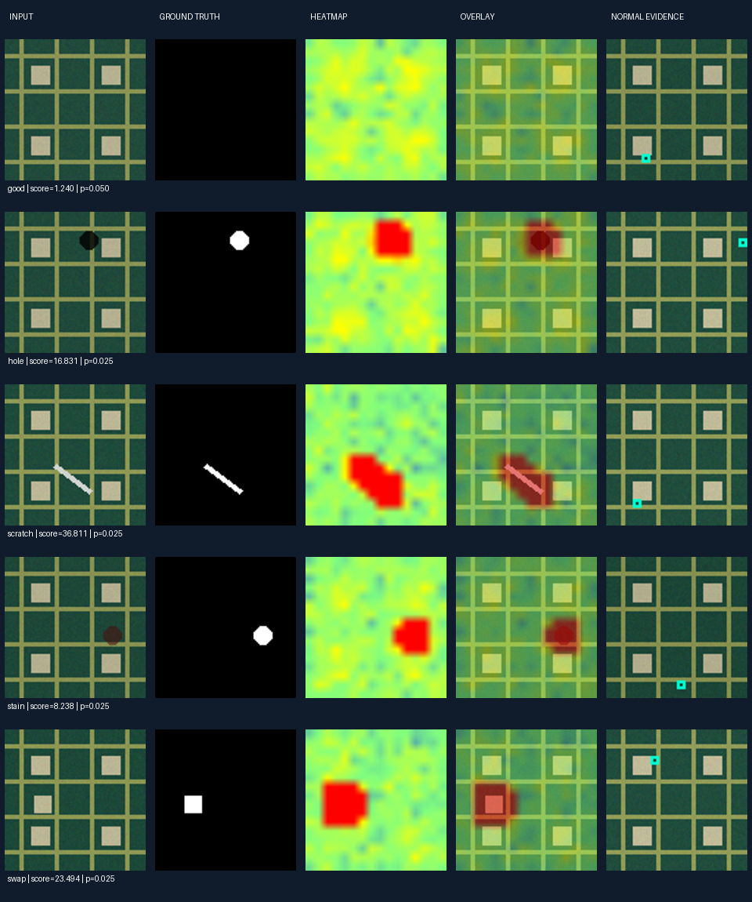

# DefectScope · 正常样本驱动的视觉缺陷检测

一个以算法实验为中心的 Python 项目：只使用正常图像拟合模型，输出图像级异常判定、局部热力图、候选缺陷区域与正常参考证据。

**它不是大模型训练项目，也不宣称提出了新的 SOTA 算法。** 核心检测、校准、评测和界面代码在本项目内独立实现。

图中为本项目生成的合成数据。

## 项目做了什么

- 两套特征：CPU 轻量多尺度纹理特征；冻结 ImageNet ResNet18 的 layer1/layer2 深度特征。
- 全局 patch 记忆库：训练特征标准化、随机候选池上的贪心最远点压缩、分块最近邻查询。
- 空间统计分支：每个网格位置学习正常均值和对角标准差。
- 可消融的可靠性融合：用正常训练样本的局部变化幅度决定空间分支权重。
- 可关闭的鲁棒光照对齐：正常模板 + IRLS 低频平面拟合，评估加性渐变光照对齐（当前压力测试仍失败）。
- 正常样本校准：四种检测策略分别计算正常性 p 值，阈值不使用异常测试标签。
- 实验闭环：内容哈希去重审计、三随机种子、四策略消融、光照压力测试、逐图 CSV。
- 本地交互工作台：样本选择、图片上传、热力图、候选区域、参考正常 patch、实验表格。

## 本机快速打开

已完成环境安装和实验的这份目录，双击 **start_demo.bat**，或运行：

~~~powershell
cd D:\xiangmu\DefectScope
.\.venv\Scripts\python.exe -m defectscope serve --model runs/bottle-resnet-s7/model.npz --samples data/mvtec/bottle/test
~~~

打开 http://127.0.0.1:8765 。关闭启动窗口或按 Ctrl+C 停止服务。若服务已运行，直接打开链接即可。

## 从 GitHub 全新安装

Python 3.11+。先进入下载后的项目根目录。

~~~powershell
python -m venv .venv
.\.venv\Scripts\python.exe -m pip install -e ".[dev]"
.\.venv\Scripts\python.exe -m defectscope generate --out data/synthetic-s7 --seed 7
.\.venv\Scripts\python.exe -m defectscope run --data data/synthetic-s7/board --out runs/demo --illumination
.\.venv\Scripts\python.exe -m defectscope serve --model runs/demo/model.npz --samples data/synthetic-s7/board/test
~~~

Linux/macOS 把 .venv\Scripts\python.exe 换成 .venv/bin/python。轻量流程只需 NumPy 和 Pillow，无需 GPU 或预训练权重。输出目录已存在完整结果时，训练命令会拒绝覆盖，请改用新目录。

## 真实图像与深度特征

~~~powershell
.\.venv\Scripts\python.exe -m pip install -e ".[deep]"
.\.venv\Scripts\python.exe scripts/download_mvtec.py
.\.venv\Scripts\python.exe -m defectscope run --data data/mvtec/bottle --out runs/bottle-resnet-s7 --extractor resnet18 --size 192 --patch 12 --memory 256 --seed 7
~~~

第一次使用深度版本会下载官方 ResNet18 权重，缓存放在项目 .cache/torch。之后可以离线运行。MVTec 下载脚本约下载 149 MiB，不下载完整数据集。公开数据链接可能变化，以官方页面为准。

真实数据包含 209 张训练正常图和 83 张测试图（20 正常 / 63 异常）。本项目从训练正常图中固定随机划分为 126 训练 / 31 调整 / 52 校准，**没有把全部 209 张正常图用于拟合记忆库**。测试集保持官方划分。预处理整图缩放到 192×192，像素评测也在这一分辨率完成。

实测表格、不同随机种子和失败案例见 [实验结果](docs/RESULTS.md)，逐次原始记录见 reports/。这些结果只能支持 bottle 单类别结论，不能与论文全类别平均分直接比较。

## 可复现实验

~~~powershell
.\.venv\Scripts\python.exe scripts/benchmark.py
.\.venv\Scripts\python.exe -m pytest -q
.\.venv\Scripts\python.exe -m defectscope predict --model runs/demo/model.npz --image data/synthetic-s7/board/test/hole/000.png --out runs/prediction
~~~

合成实验默认 3 类 × 3 个种子 × 2 个光照设置 × 4 个检测策略，共 72 组指标。每种特征和光照配置的四个策略共享拟合特征，但各自独立校准。保存模型是 NPZ 数组格式，不使用 pickle。

## 目录

~~~text
src/defectscope/
  features.py       纹理特征与冻结 ResNet18
  illumination.py   鲁棒光照对齐
  model.py          记忆库、空间统计、融合、模型持久化
  metrics.py        AUROC、混淆矩阵、正常性校准
  data.py           合成生成器与 MVTec 目录适配
  experiment.py     训练与评测闭环
  reporting.py      可视化与导出
  server.py         本地服务
  web/index.html    中文工作台
scripts/            数据下载、多种子实验、演示启动
tests/              算法与服务测试
docs/               方法说明、实验解释、简历与面试材料
reports/            可提交的指标和逐图记录
data/ runs/ .cache/ 本地数据、模型与缓存，不提交
~~~

## 原创性与边界

本项目的价值在于独立工程实现、可验证的组合方案和严谨实验。记忆库异常检测、ResNet、IRLS 与 conformal calibration 都有已有研究基础。门控融合是本项目的设计假设，**没有完成证明其研究首创性的系统文献审查，也没有实验支持它总是优于简单基线**。

完整公式与取舍见 [METHOD.md](docs/METHOD.md)，来源和依赖边界见 [ORIGINALITY.md](docs/ORIGINALITY.md)。

## 主要限制

- 每个模型面向一个类别和相近拍摄条件，不是任意图片通用检测器。
- 网格分辨率有限，输出是候选区域，不是精细工业分割。
- 正常性 p 值不是缺陷概率。校准结论依赖正常样本可交换性，分布变化可能导致高误报。
- 记忆库源图片路径与训练环境关联；移动模型后评分仍可用，但要重训或保留源图片路径才能显示参考图。
- 本地演示服务绑定 127.0.0.1，不是已加固的公网部署服务。
- 项目不包含真实产线部署、大模型微调或线上业务收益。

## 参考与许可

代码使用 MIT License。第三方依赖、模型权重和数据适用各自许可，详情见 THIRD_PARTY_NOTICES.md。MVTec AD 是 CC BY-NC-SA 4.0 数据，非商业研究使用，原图不随仓库发布。

- [PatchCore / CVPR 2022](https://openaccess.thecvf.com/content/CVPR2022/html/Roth_Towards_Total_Recall_in_Industrial_Anomaly_Detection_CVPR_2022_paper.html)
- [Torchvision ResNet18](https://docs.pytorch.org/vision/stable/models/generated/torchvision.models.resnet18.html)
- [Conformal prediction introduction](https://arxiv.org/abs/2107.07511)
- [MVTec AD 官方数据](https://www.mvtec.com/research-teaching/datasets/mvtec-ad)
